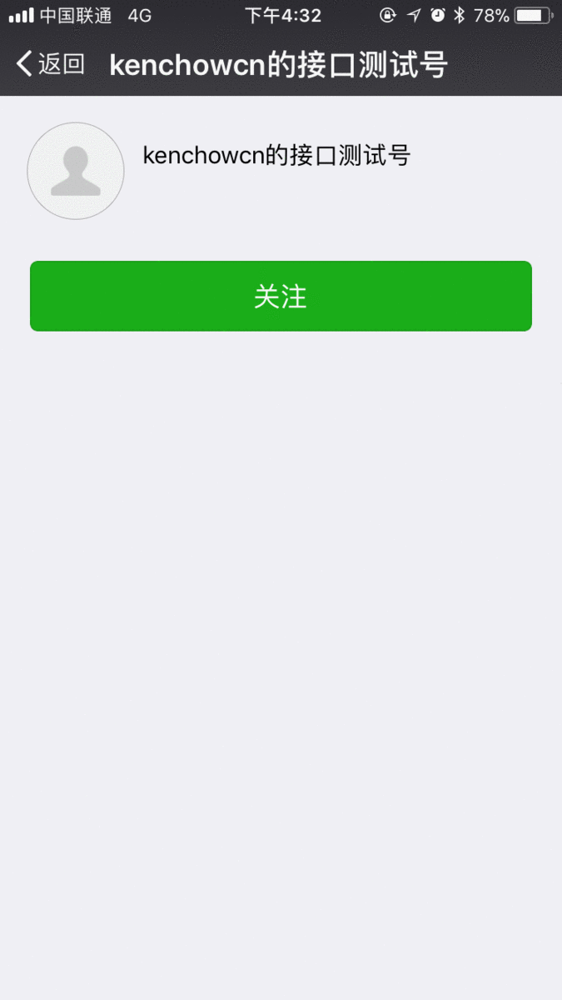

# wei-bot

**wei-bot**能通过微信公共号，让指定用户在服务器上执行脚本。

## 当前功能

- 特定脚本执行
- 个性化定制菜单栏，在微信一键执行脚本
- 一键抓取新闻在微信上阅读
- 讲个笑话
- 查询图片

## 必备条件

- 一个微信公众平台的订阅号（个人未认证也可以）；
- 一台VPS服务器

## 安装配置

## 问题

- 有什么新想法可以在这里讨论：[https://github.com/weiofcn/wei-bot/issues](https://github.com/weiofcn/wei-bot/issues)
